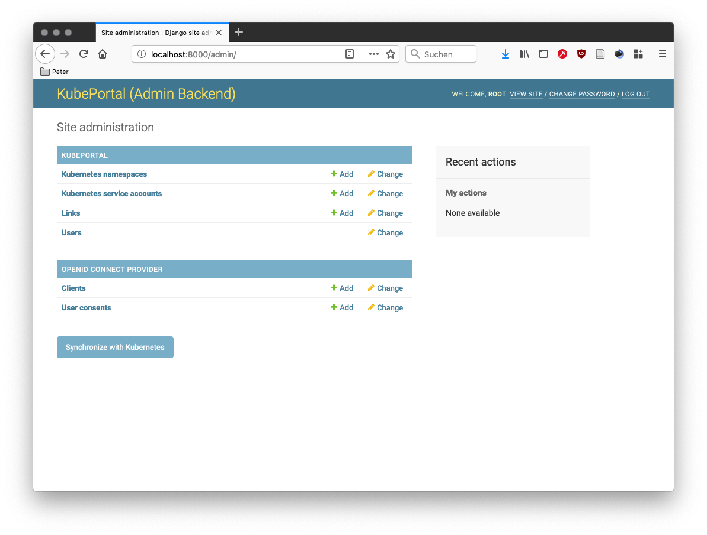

.. _administrator:

Introduction
############

KubePortal implements a single sign-on portal for Kubernetes clusters. 
It provides the following functionalities:

.. figure:: static/kubeportal4.png
    :alt: KubePortal frontend login screen.

    Portal users can use their organizational Active Directory, Google, 
    or Twitter login.

.. figure:: static/kubeportal5.png
    :alt: KubePortal landing page. 

    After login, a landing page is shown that offers the possibility to request 
    Kubernetes access and become a *cluster user*.

.. figure:: static/kubeportal1.png
    :alt: KubePortal landing page for cluster users.

    For approved cluster users, the portal offers a list of links to other web
    applications such as Grafana or Kubernetes Dashboard. The authentication for
    these web applications is provided (via OAuth) through KubePortal,
    so that users get a single sign-on experience.

.. figure:: static/kubeportal2.png
    :alt: Kubectl config file download for cluster users.

    Approved cluster users also get a download page for their personal KUBECTL
    configuration file.

.. figure:: static/kubeportal3.png
    :alt: Backend for user management.

    Portal users with admin rights can access the KubePortal backend,
    which supports the assignment of known accounts to Kubernetes namespaces resp.
    service accounts.

Installation
############

The latest official release of KubePortal is available as `Docker image <https://hub.docker.com/r/troeger/kubeportal/>`__,
which can be deployed to your Kubernetes cluster in various ways.

Example YML files are available in the `source code repository <https://github.com/troeger/kubeportal/tree/master/deployment/k8s>`_.

The application can be configured through environment variables:

===================================== ============================================================================
Environment variable                  Description
===================================== ============================================================================
KUBEPORTAL_AUTH_TWITTER_KEY           Client key for OAuth when offering frontend Twitter login.
KUBEPORTAL_AUTH_TWITTER_SECRET        Client secret for OAuth when offering frontend Twitter login.
KUBEPORTAL_AUTH_GOOGLE_KEY            Client key for OAuth when offering frontend Google login.
KUBEPORTAL_AUTH_GOOGLE_SECRET         Client secret for OAuth when offering frontend Google login.
KUBEPORTAL_AUTH_AD_DOMAIN             Domain when offering frontend Active Directory login, e.g. ``example.com``.
KUBEPORTAL_AUTH_AD_SERVER             Active directory server when offering frontend Active Directory login, e.g. ``192.168.1.1``. Not needed when equal to the A record behind the value of ``KUBEPORTAL_AUTH_AD_DOMAIN``.
KUBEPORTAL_SESSION_COOKIE_DOMAIN      The domain used for the user session cookie, e.g. ``.example.com``.     
KUBEPORTAL_NAMESPACE_CLUSTERROLES     Kubernetes cluster roles that should be bound to the *default* service account of newly created Kubernetes namespaces, e.g. ``minimal-api,standard-api``.
KUBEPORTAL_BRANDING                   The human-readable name of your cluster.
KUBEPORTAL_CLUSTER_API_SERVER         The URL for your Kubernetes API server, e.g. ``https://k8smaster.example.com:6443``.
KUBEPORTAL_LANGUAGE_CODE              The locale for the web site, e.g. ``en-us``.
KUBEPORTAL_TIME_ZONE                  The time zone for the web site, e.g. ``UTC``.
KUBEPORTAL_ADMIN_NAME                 The name of the superuser, used only for email sending.
KUBEPORTAL_ADMIN_EMAIL                The email address of the superuser.
KUBEPORTAL_EMAIL_HOST                 The SMTP server used by the web site for sending mails.
KUBEPORTAL_DATABASE_URL               The database to be used as URL (see `formatting examples <https://github.com/jacobian/dj-database-url>`), e.g. ``sqlite:////data/kubeportal.sqlite3``. 
KUBEPORTAL_REDIRECT_HOSTS             Hosts that redirect to the KubePortal web page, typically to perform OAuth authenication. Example: ``grafana.example.com, registry.example.com``.
===================================== ============================================================================

It is recommended to configure at least the following settings:

  - One authentication method (``KUBEPORTAL_AUTH_...``)
  - A reasonable path for the SQLite database in ``KUBEPORTAL_DATABASE_URL``, so that your user database persists on a mounted Kubernetes volume.
  - ``KUBEPORTAL_BRANDING`` and ``KUBEPORTAL_CLUSTER_API_SERVER``, since these values are needed for the generated *kubectl* config files.

The `example YMLs <https://github.com/troeger/kubeportal/tree/master/deployment/k8s>`_ show how these variables can be set through a standard Kubernetes config map.

After the first deployment, the log output of the KubePortal pod shows you the generated password for the *root* account once (!).
This account **only** works for the backend login page, which is available at `<KubePortal URL>/admin/`.

Configuring RBAC
----------------

Depending on your cluster setup, you may need to give KubePortal several permissions for API server access.
Please check the `example YMLs <https://github.com/troeger/kubeportal/tree/master/deployment/k8s>`_ for further information.

Data synchronization
####################

KubePortal synchronizes the current list of Kubernetes namespaces and service accounts with your Kubernetes API server instance.
It can create Kubernetes namespaces for new portal users, but will  **never** delete anything in your cluster, even if the linked portal user is deleted. 

You can trigger the sychronization manually on the backend landing page:

This is needed once after the installation, so that KubePortal gets the initial list of namespaces. It is also neccessary when
you create or modify namespaces directly in the cluster.

Enabling cluster access for users
#################################

After deployment, first check if your configured frontend authentication method works as expected. The frontend user should see this welcome screen:

.. image:: static/kubeportal5.png

A click on the *request for cluster access* sends an email to all backend-enabled users:

.. image:: static/kubeportal8.png

You can also see in the users list in the backend that the cluster access status of the user changed to *requested*:

.. image:: static/kubeportal7.png

The admin(s) can now decide upon this request:

.. image:: static/kubeportal11.png

The link to this decision page is also sent by email to all portal users with backend access.

You have the choice between creating a new Kubernetes namespace for this user, using an existing one, or rejecting the request.
After acknowledging the request, the frontend changes immediately for the portal user. She can now access the *kubectl* config file
for the *default* service account in the chosen namespace.

Configuring admin users
#######################

Users known to the system, meaning that they logged-in at least once, can be promoted for being an admin user.
They have access to the backend pages, and get an email notification when users request cluster access.

A user can be granted admin rights by activating the *Staff status* checkbox in the user details.

The user 'root' automatically has this role.

Configuring portal links
########################

Portal links are shown to users that have cluster access:

.. figure:: static/kubeportal1.png
    :alt: KubePortal landing page for cluster users.

They are configurable in the admin backend in the section *Links*.

The target URL can use placeholders, so that customized URLs are possible:

  - *{{namespace}}*: Inserts the configured Kubernetes namespace name for the portal user in the URL.
  - *{{serviceaccount}}*: Inserts the configured Kubernetes service account for the portal user in the URL.

Example for `Kubernetes Dashboard <https://github.com/kubernetes/dashboard>`_:

``https://dashboard.example.com/#!/overview?namespace={{namespace}}``

Authentication provider for NGINX
#################################

Web applications offered through the `NGINX Ingress Controller <https://kubernetes.github.io/ingress-nginx/>`_ can be
protected with a KubePortal login.

One popular use case is the `Kubernetes Dashboard <https://github.com/kubernetes/dashboard>`_.

The trick is to configure the Ingress controller to perform a 
`sub-auth request <https://kubernetes.github.io/ingress-nginx/examples/auth/oauth-external-auth/>`_ when the web
application is called. The link `<KubePortal URL>/subauthreq/` provides the neccessary
authentication check functionality. Please note that `KUBEPORTAL_SESSION_COOKIE_DOMAIN` must be set to a value
that matches both to your portal and application DNS name, e.g. `.example.com`, otherwise the login check will always fail.

Example:

.. code-block:: 

  apiVersion: extensions/v1beta1
  kind: Ingress
  metadata:
    name: kubernetes-dashboard
    namespace: kube-system
    annotations:
      kubernetes.io/ingress.class: nginx
      certmanager.k8s.io/cluster-issuer: letsencrypt
      nginx.ingress.kubernetes.io/auth-url: "https://portal.example.com/subauthreq"
      nginx.ingress.kubernetes.io/auth-signin: "https://portal.example.com"
      nginx.ingress.kubernetes.io/auth-response-headers: Authorization
  spec:
    tls:
    - secretName: "dashboard-tls"
      hosts:
      - "dashboard.example.com"
    rules:
    - host: "dashboard.example.com"
      http: 
        paths: 
        - path:
          backend:
            serviceName: kubernetes-dashboard
            servicePort: 80

If you are struggling with the authentication, don't forget to check the KubePortal log files for further information.

Authentication provider for OIDC
#################################

KubePortal operates as `OpenID Connect (OIDC) <https://openid.net/connect/>`_ provider, so web application such as `Grafana <https://grafana.com/>`_ can
use it for authentication.

The first step is to create a new OIDC client in the KubePortal backend. This generates a client ID
and client secret for your web application. Given these two, you can now configure your web application
for OIDC authentication:

  - The recommended authentication scopes are `openid`, `profile`, and `email`.
  - The link `<KubePortal URL>/oidc/authorize` provides the authorization page.
  - The link `<KubePortal URL>/oidc/token` provides the token information.
  - The link `<KubePortal URL>/oidc/userinfo` provides the OAuth API for fetching user information.

