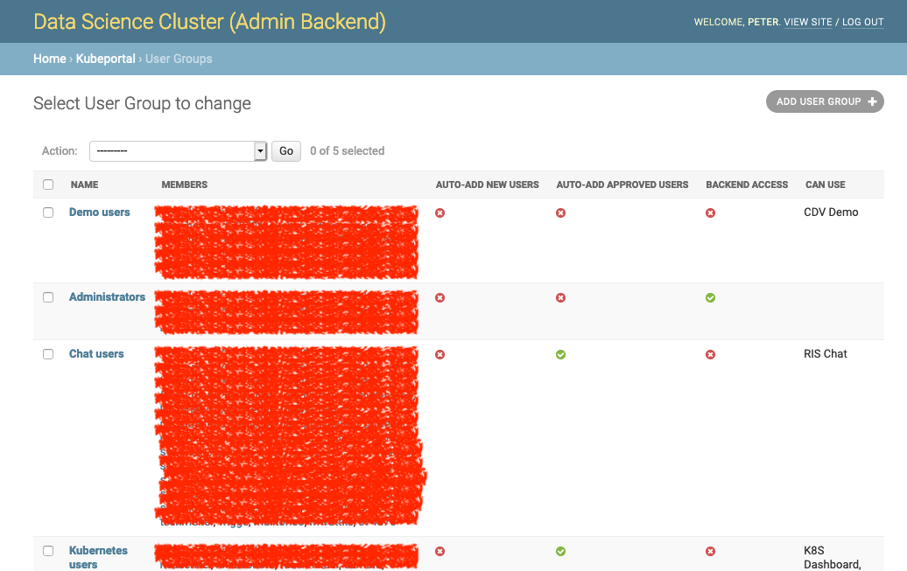

User groups
###########

Portal users are organized into groups. The membership in group decides upon the access rights to the portal backend and web applications.

You can see the list of existing user groups on the group overview page:

A click on the name brings you to the details page:

.. image:: static/back_groupdetail.png

Auto-add
--------

Groups can be configured to be automatically filled with all portal users ("Auto-add new users") or with all approved cluster users ("Auto-add approved users"). This allows you to give access to cluster-related web applications, such as Grafana or K8S dashboard, only to people that actually got a Kubernetes account.

Administrators
--------------

A user can be granted admin rights by making it member of a group with *Backend access* enabled. It is therefore reasonable to have at least one group where this flag is set, and add yourself to it.

Web application access
----------------------

The group membership of a user decides which web applications are accessible for her. These permissions are cumulative, so membership in multiple groups can give user access to different web applications.

The group concept allows you to implement different scenarios:

* All portal users should be able to use a particular web application, regardless of their cluster approval status:

  * Create a group with "auto-add new users" enabled.

  * Give that group access to the web application.

* All users with Kubernetes cluster access should be able to use a particular web application, e.g. Kubernetes Dashboard:

  * Create a group with "auto-add approved users" enabled.

  * Give that group access to the Kubernetes Dashboard web application.

* Administrators should have web applications available that are not for ordinary cluster users, e.g. Grafana:

  * Create a group with "Backend access" enabled.

  * Manage the group members manually.

  * Give that group access to the Grafana web application.

* Some web applications should be only available to special people:

  * Create a group and manage the members manually.

  * Give that group access to the chosen web application.
