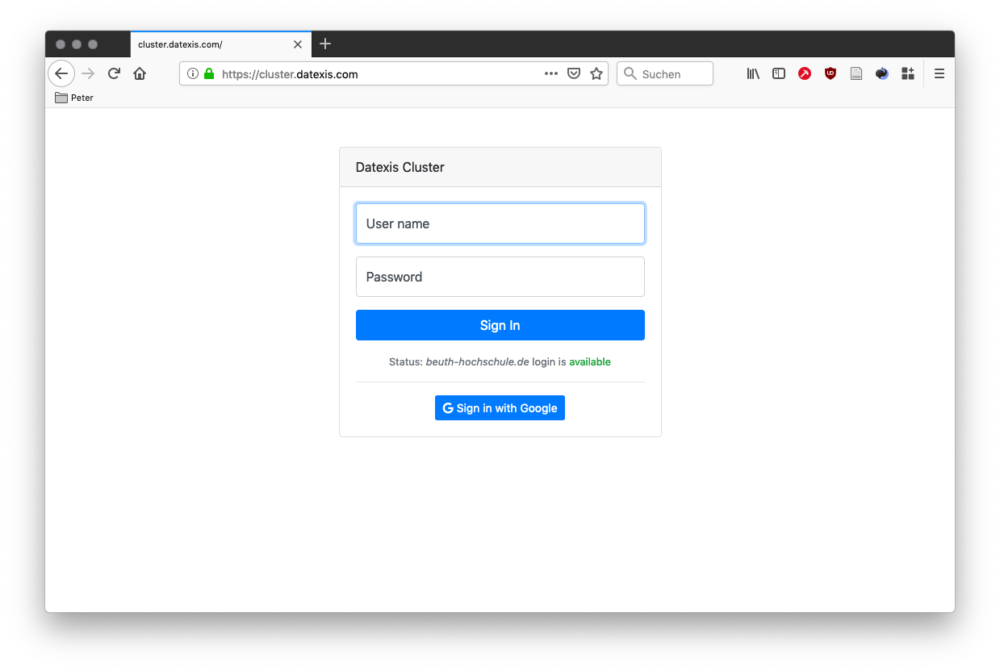
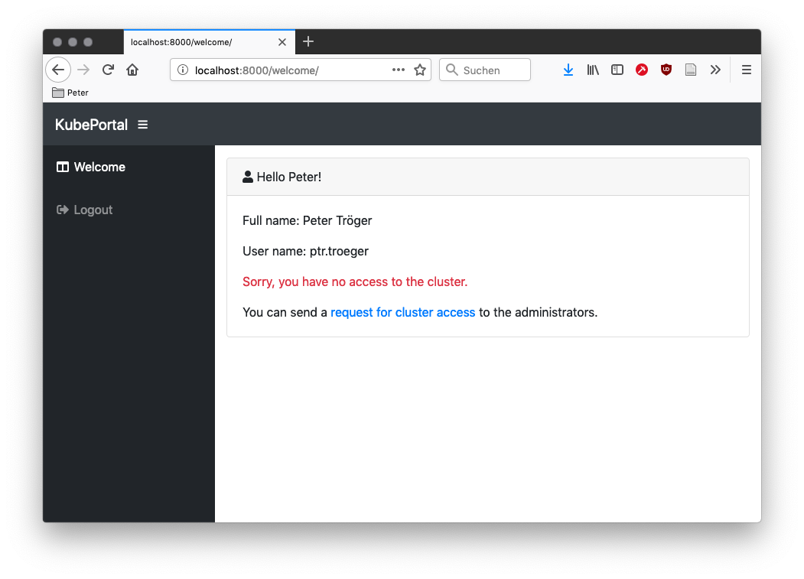
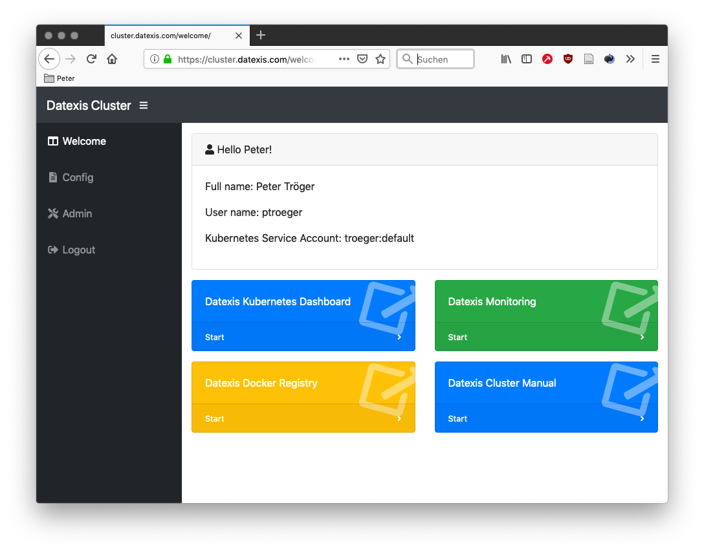
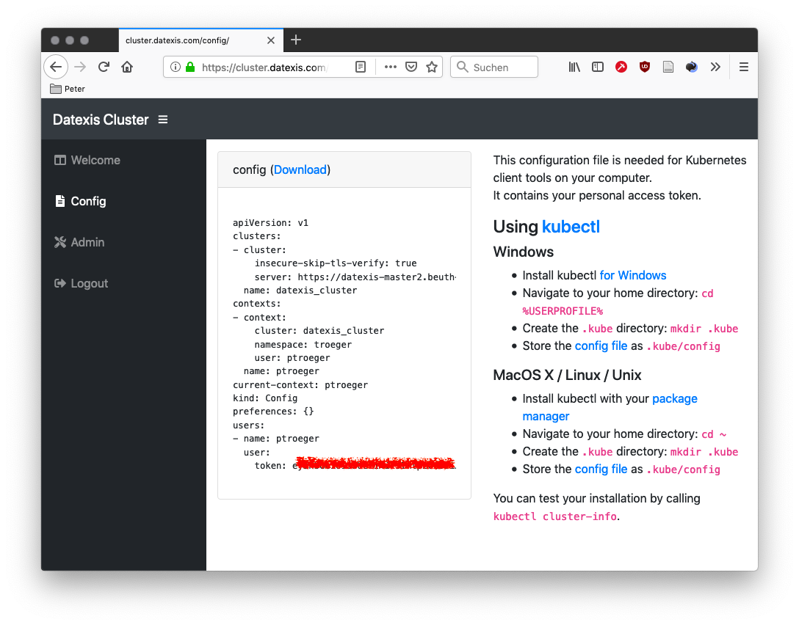
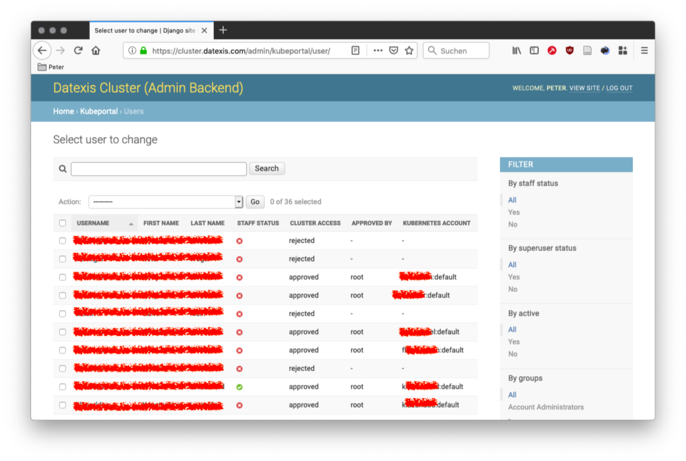

KubePortal Documentation
########################

.. warning::

   The manuals are work in progress and therefore incomplete. Feel free to help us with a `pull request on GitHub <https://github.com/troeger/kubeportal>`_.

.. _index:

Kubeportal is a web application to get a single sign-on Kubernetes experience. It operates as synchronizing entity between a portal user base and Kubernetes service accounts resp. namespaces.

After portal login, users can download their kubectl config file directly from the web site. Their service accounts and namespaces are configured by administrative users in the backend.

Kubeportal acts as OAuth2 and WebHook authentication provider. This enables other web applications to use it as authorization service.

    Portal users can use their organizational Active Directory, Google,
    or Twitter login.

    After login, a landing page is shown that offers the possibility to request
    Kubernetes access and become a *cluster user*.

    For approved cluster users, the portal offers a list of links to other web
    applications such as Grafana or Kubernetes Dashboard. The authentication for
    these web applications is provided through KubePortal,
    so that users get a single sign-on experience.

    Approved cluster users also get a download page for their personal KUBECTL
    configuration file.

    Portal users with admin rights can access the KubePortal backend,
    which supports the assignment of known accounts to Kubernetes namespaces resp.
    service accounts.

.. toctree::
   installation
   users
   sync
   links
   webhook
   oidc
   api
   changelog
   dev-env
