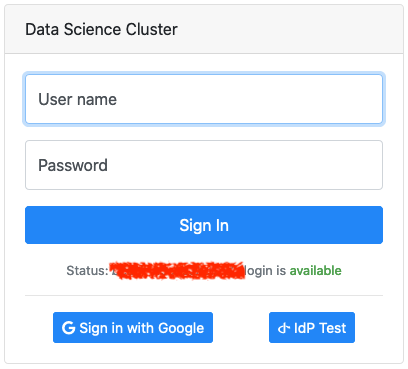

KubePortal Documentation
########################

.. warning::

   The manuals are work in progress and therefore incomplete. Feel free to help us with a `pull request on GitHub <https://github.com/troeger/kubeportal>`_.

.. _index:

KubePortal is a web portal for Kubernetes clusters. It offers the following main features:

  * User login with existing credentials (Active Directory, Google, Twitter, ...)
  * Landing page with quick links to web applications (Grafana, K8S Dashboard, ...)
  * User-friendly process for requesting Kubernetes cluster access
  * Self-service download of ``kubectl`` config file
  * Login for web applications through the portal  
  * Admin backend for user permission management

Here are some screenshots:

    Portal users can use an existing account to enter the cluster portal.

.. figure:: static/front_landing_new.png
    :alt: KubePortal landing page.

    After login, a landing page is shown that offers the possibility to request
    Kubernetes access and become a *cluster user*.

.. figure:: static/front_landing.png
    :alt: KubePortal landing page for cluster users.

    For approved cluster users, the portal can offer a list of links to other web
    applications, such as Grafana or Kubernetes Dashboard. The authentication for
    these web applications is, again, provided through KubePortal,
    so that users get a single sign-on experience.

.. figure:: static/front_config.png
    :alt: Kubectl config file download for cluster users.

    Approved cluster users also get a download page for their personal KUBECTL
    configuration file.

    Portal users with admin rights can access the KubePortal backend,
    which supports the assignment of known accounts to Kubernetes namespaces resp.
    service accounts.

.. toctree::
   :hidden:

   installation
   users
   groups
   links
   api
   dev-env
   changelog
