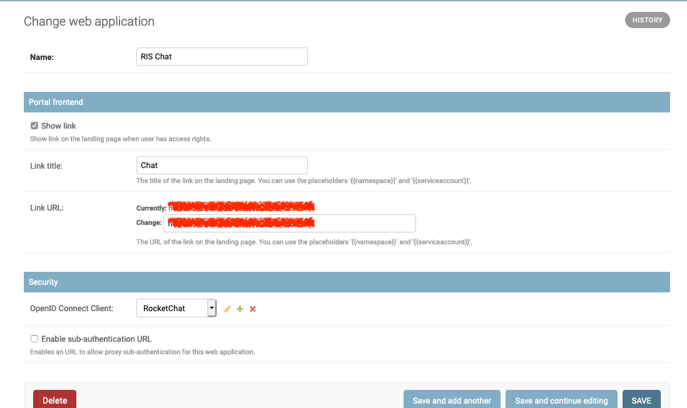

Web applications
################

KubePortal can be used to manage the access to web applications, which typically run in the cluster itself. A typical example is `Kubernetes Dashboard <https://github.com/kubernetes/dashboard>`_, which can be used as graphical frontend for cluster management.

The current list of configured web applications is accessible in the backend. When creating a new web application entry, you have a set of options for the integration in the portal described below.

Frontend link
-------------

A web application can be presented as link on the landing page for users. Both the name shown and the URL are customizable. The target URL can use placeholders, so that customized URLs are possible:

  - *{{namespace}}*: Inserts the configured Kubernetes namespace name for the portal user in the URL.
  - *{{serviceaccount}}*: Inserts the configured Kubernetes service account for the portal user in the URL.

A simply example where this becomes handy is a link to the K8S dashboard page of the user accessing the portal:

``https://dashboard.example.com/#!/overview?namespace={{namespace}}``

A link to the web application is only shown when the user has access permissions (see :ref:`User groups`). 

Login through portal (OIDC)
---------------------------

KubePortal operates as `OpenID Connect (OIDC) <https://openid.net/connect/>`_ provider, so web application such as `Grafana <https://grafana.com/>`_ can use the portal for authentication. For users already logged into the portal with the same browser, the web application then just works. Anonymous users are redirected by the web application to the portal for login.

To allow OIDC-enabled web applications to use the portal, you need to create an OpenID Connect client in the web application settings:

Please note that the client secret is generated automatically and can be seen in the web application overview list. The redirect URIs depend on the particular web application you are trying to integrate. 

The web application also needs some settings:

  - Client ID and client secret are shown in the web application overview page.	
  - The recommended authentication scopes are `openid`, `profile`, and `email`.
  - The link `<KubePortal URL>/oidc/authorize` provides the authorization endpoint.
  - The link `<KubePortal URL>/oidc/token` provides the token information endpoint.
  - The link `<KubePortal URL>/oidc/userinfo` provides the API endpoint for fetching user information.
  - The returned JSON with user information contains the keys 'nickname' (aka username), 'given_name', 'family_name', 'name', and 'email'.

The login through OIDC is only possible if the user has access permissions for this web application (see :ref:`User groups`). 

Example configuration for Grafana:

.. code-block:: 

	apiVersion: apps/v1beta2
	kind: Deployment
	metadata:
	  labels:
	    app: grafana
	  name: grafana
	  namespace: monitor
	spec:
	  replicas: 1
	  selector:
	    matchLabels:
	      app: grafana
	  template:
	    metadata:
	      labels:
	        app: grafana
	    spec:
	      containers:
	      - image: grafana/grafana:5.4.3
	        name: grafana
	        env:
	          - name: GF_AUTH_ANONYMOUS_ENABLED
	            value: "true"
	          - name: GF_AUTH_ANONYMOUS_ORG_NAME
	            value: "Internet"
	          - name: GF_AUTH_ANONYMOUS_ORG_ROLE
	            value: "Viewer"
	          - name: GF_AUTH_BASIC_ENABLED
	            value: "false"
	          - name: GF_SERVER_ROOT_URL
	            value: "https://monitoring.example.com"
	          - name: GF_AUTH_DISABLE_LOGIN_FORM
	            value: "true"
	          - name: GF_AUTH_GENERIC_OAUTH_ENABLED
	            value: "true"
	          - name: GF_AUTH_GENERIC_OAUTH_CLIENT_ID
	            value: "monitoring-service"  
	          - name: GF_AUTH_GENERIC_OAUTH_CLIENT_SECRET
	            value: "c444e7641dc8cc5c638fhh83e6bc0f2288854cda355ed103b3e1118ea3cd3e5"
	          - name: GF_AUTH_GENERIC_OAUTH_ALLOW_SIGN_UP
	            value: "true"
	          - name: GF_AUTH_GENERIC_OAUTH_SCOPES
	            value: "openid profile email"
	          - name: GF_AUTH_GENERIC_OAUTH_AUTH_URL
	            value: "https://portal.example.com/oidc/authorize"
	          - name: GF_AUTH_GENERIC_OAUTH_TOKEN_URL
	            value: "https://portal.example.com/oidc/token"
	          - name: GF_AUTH_GENERIC_OAUTH_API_URL
	            value: "https://portal.example.com/oidc/userinfo"
	  ...

Login through portal (sub-auth)
-------------------------------

When you operate your web applications in the cluster itself, and rely on the `NGINX Ingress Controller <https://kubernetes.github.io/ingress-nginx/>`_, it is possible to use another portal authentication method called 'sub-authentication'. One use case for this is the `Kubernetes Dashboard <https://github.com/kubernetes/dashboard>`_.

Sub-authentication can be separately enabled per web application. This generates  a special sub-authentication URL that is only valid for this app. This URL can be seen on the web application overview page.

The URL must be added to the Ingress definition of the application about to be protected. The details are described in the `NginX ingress documentation <https://kubernetes.github.io/ingress-nginx/examples/auth/oauth-external-auth/>`_. 

Example:

.. code-block:: 

  apiVersion: extensions/v1beta1
  kind: Ingress
  metadata:
    name: kubernetes-dashboard
    namespace: kube-system
    annotations:
      kubernetes.io/ingress.class: nginx
      certmanager.k8s.io/cluster-issuer: letsencrypt
      nginx.ingress.kubernetes.io/auth-url: "https://portal.example.com/subauthreq/3"
      nginx.ingress.kubernetes.io/auth-signin: "https://portal.example.com"
      nginx.ingress.kubernetes.io/auth-response-headers: Authorization
  spec:
    tls:
    - secretName: "dashboard-tls"
      hosts:
      - "dashboard.example.com"
    rules:
    - host: "dashboard.example.com"
      http: 
        paths: 
        - path:
          backend:
            serviceName: kubernetes-dashboard
            servicePort: 80

Please note that `KUBEPORTAL_SESSION_COOKIE_DOMAIN` (see :ref:`Configuration options`) must be set to a value that matches both to your portal and web application DNS name, e.g. `.example.com`, otherwise the login check will always fail. This means that all web application URLs using this mechanism must live in the same DNS zone as your portal installation.

The login through sub-authentication is only possible if the user has access permissions for this web application (see :ref:`User groups`). 

