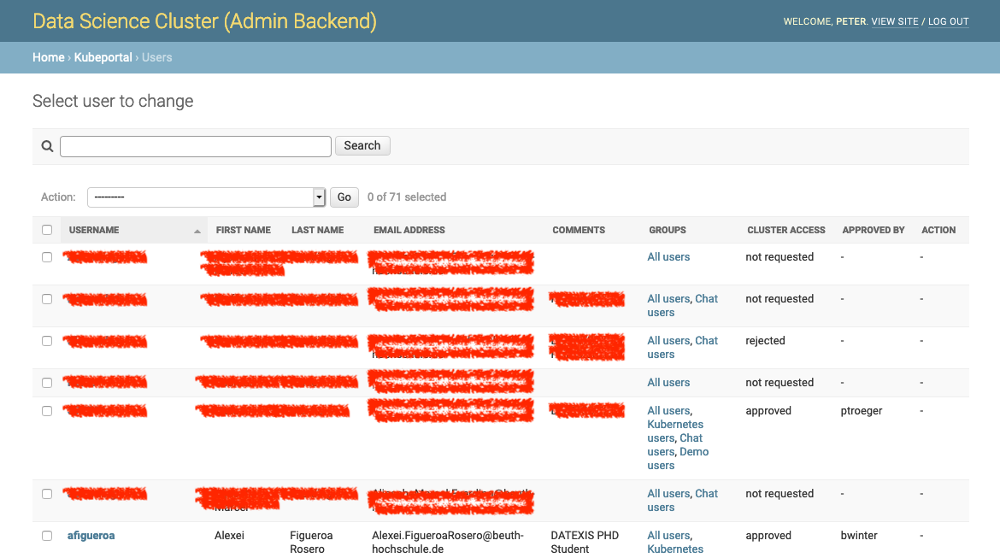
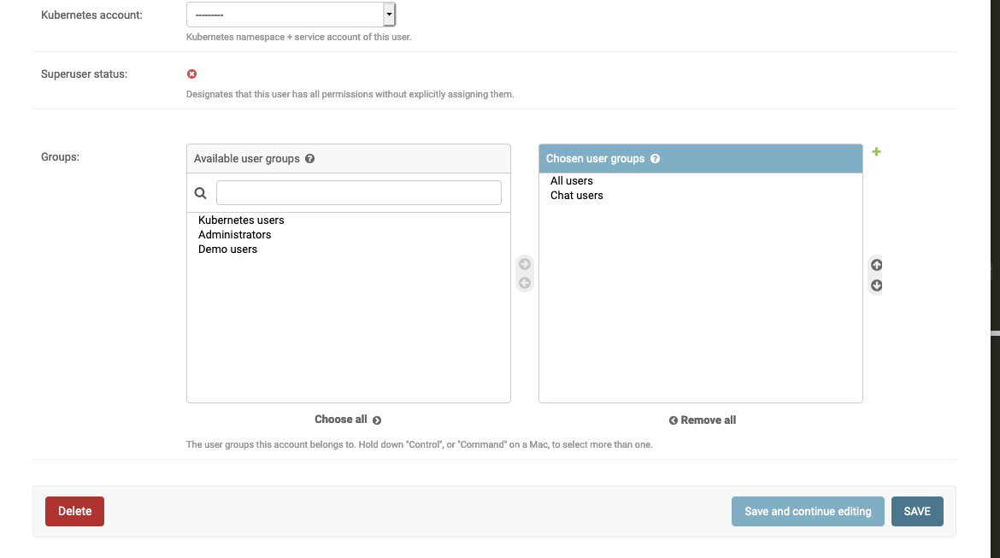
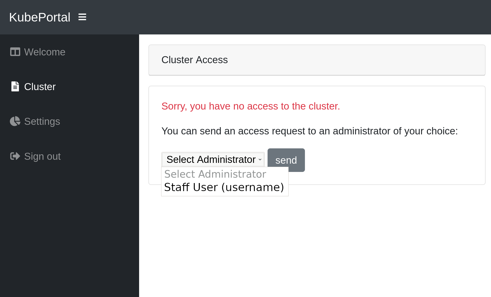
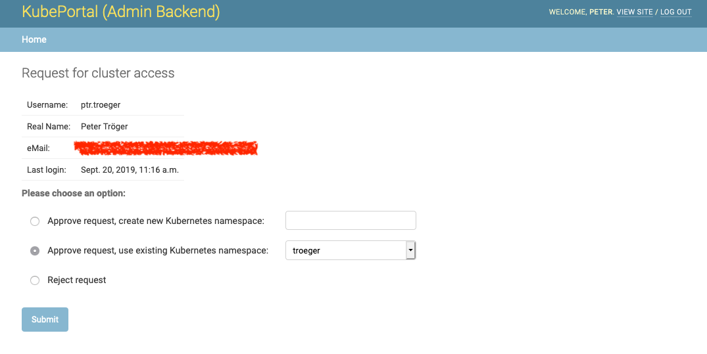
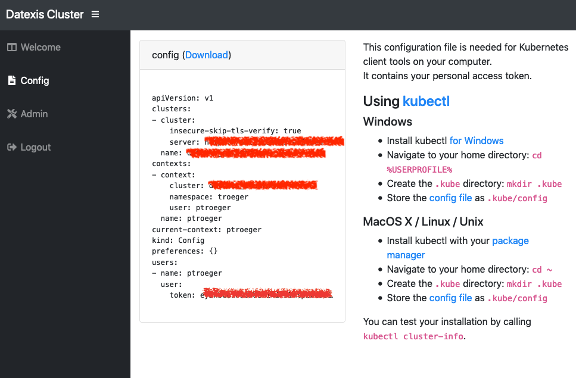
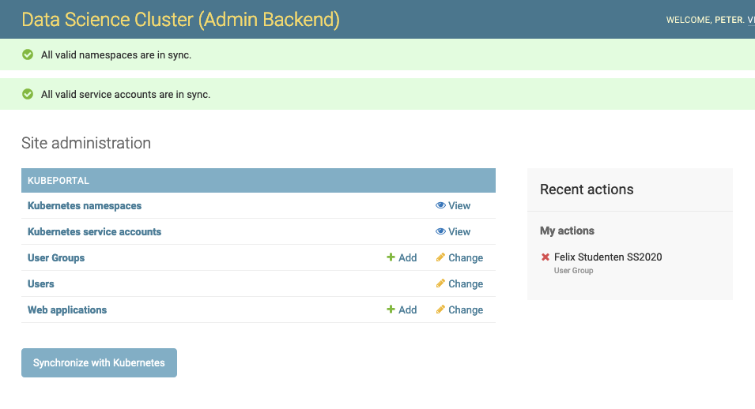
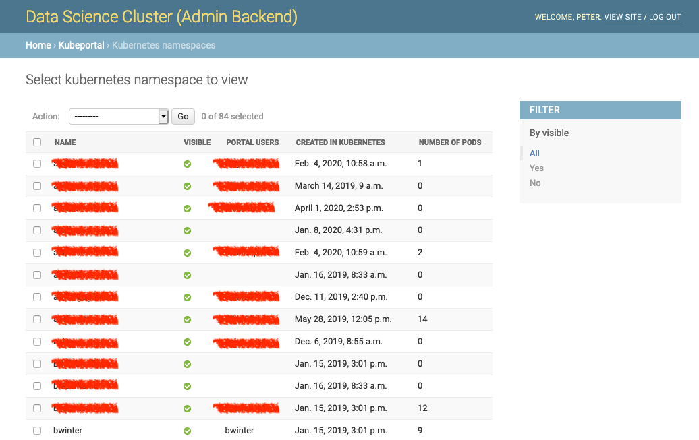
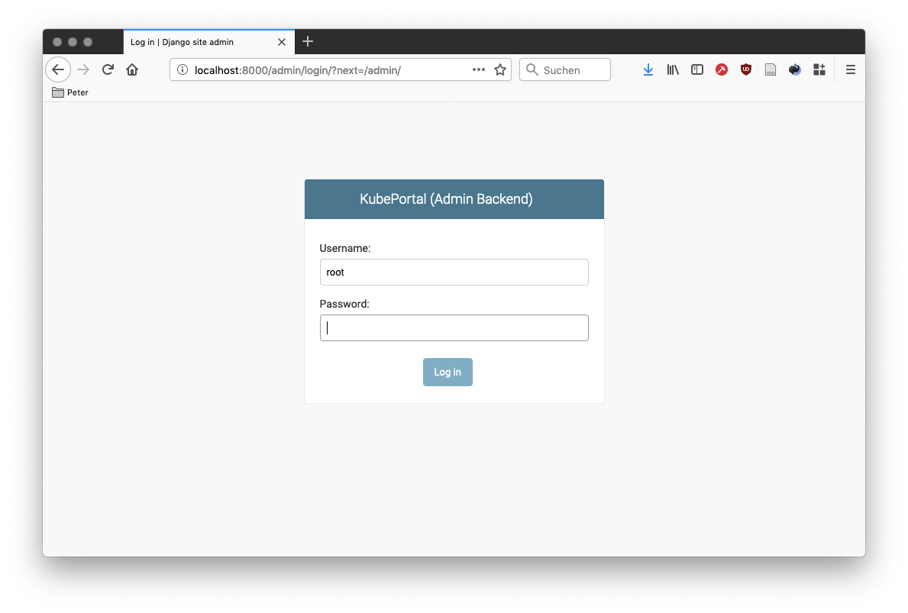

User management
###############

All users that ever logged into the portal are shown in the user section of the backend:

A new user has, by default, no access rights to the Kubernetes cluster. She may already be part of one or more user groups (see :ref:`User groups`), which could already provide access to chosen web applications. This depends on the particular installation. With a fresh installation, however, new users have no rights for any kind of resource.

Managing user details
---------------------

Many of the user details are already taken from the frontend login mechanism, such as the real name or the email address from Active Directory.

The comment field allows to store arbitrary information that is only visible in the backend.

The cluster access status field can be modified directly, but should normally only change as part of an approval procedure (see :ref:`Managing cluster access`). When users should be removed from cluster access, but not from the portal, it is the easiest to set their *cluster access* status manually to `rejected` here.

Users can belong to a set of user groups, which can be configured individually:

This gives the user permissions for web applications or the backend itself (see :ref:`User groups`). You can manually add single users to groups by editing their user details directly. Alternatively, it is also possible to perform bulk addition to groups on the user overview page.

Managing cluster access
-----------------------

Users can click a link on the front page to apply for Kubernetes credentials:

All (!) admins get an email notification when users request cluster access. The approving or rejecting admin for a user approval request is logged in the database. The link to a decision page is sent with the email. The admin(s) can now decide upon this request:

You have the choice between creating a new Kubernetes namespace for this user, using an existing one, or rejecting the request. KubePortal synchronizes the decision with the Kubernetes API server, so that namespaces are automatically created when needed.

After acknowledging the request, the frontend changes immediately for the portal user. She can now access the *kubectl* config file for the *default* service account in the chosen namespace:

KubePortal synchronizes the list of available Kubernetes namespaces and service accounts with your Kubernetes API server. It can create Kubernetes namespaces for new portal users, but will  **never** delete anything in your cluster, even if the linked portal user is deleted. 

You can trigger the sychronization manually on the backend landing page:

This is needed once after the installation, so that KubePortal gets the initial list of namespaces. It is also neccessary when you create or modify namespaces directly in the cluster.

KubePortal provides a basic set of information about your cluster users, so that you can identify dead accounts. These informations are shown on the namespace overview page.

On the overview page, namespaces can be configured for being invisible in the portal. This allows you to hide them from the selection of available namespaces in the approval step above, so that things such as ``kube-system`` are not a valid choice for end user accounts.

Superuser
---------

On startup, the log output of the KubePortal pod shows you a generated password for the *root* account. This account **only** works on a special backend login page, which is available at `<KubePortal URL>/admin/`:

It allows you to enter the admin backend while by-passing all configured frontend login methods. This is especially helpful with an empty database after installation.

