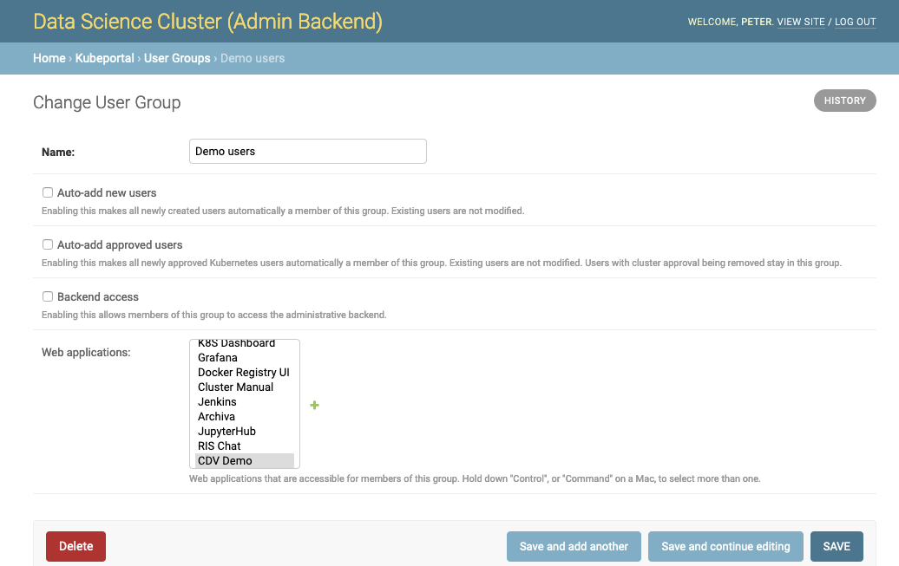

User management
###############

After installation, first check if your configured frontend authentication method works as expected. The frontend user should then see this welcome screen:

.. image:: static/front_landing_new.png

A click on the *request for cluster access* sends an email to all configured administrators. It is now the task of the administrators to approve this user and give her admin access, in case.

Backend access with root account
--------------------------------

The log output of the KubePortal pod shows you a generated password for the *root* account. This account **only** works on a special backend login page, which is available at `<KubePortal URL>/admin/`:

.. image:: static/back_login.png

It allows you to enter the admin backend:

.. image:: static/back_landing.png

User overview
-------------

All users that ever logged into the portal are shown in the user section of the backend:

.. image:: static/back_userlist.png

Managing Kubernetes accounts
----------------------------

Users can click a link on the front page to apply for Kubernetes credentials:

.. image:: static/front_landing_new.png

All (!) admins get an email notification when users request cluster access. The approving or rejecting admin for a user approval request is logged in the database. The link to a decision page is sent with the email. The admin(s) can now decide upon this request:

.. image:: static/back_approval.png

You have the choice between creating a new Kubernetes namespace for this user, using an existing one, or rejecting the request. KubePortal synchronizes the decision with the Kubernetes API server, so that the namespace automatically is created when needed.

After acknowledging the request, the frontend changes immediately for the portal user. She can now access the *kubectl* config file for the *default* service account in the chosen namespace:

.. image:: static/front_config.png

KubePortal synchronizes the list of available Kubernetes namespaces and service accounts with your Kubernetes API server. It can create Kubernetes namespaces for new portal users, but will  **never** delete anything in your cluster, even if the linked portal user is deleted. 

You can trigger the sychronization manually on the backend landing page:

.. image:: static/back_landing.png

This is needed once after the installation, so that KubePortal gets the initial list of namespaces. It is also neccessary when you create or modify namespaces directly in the cluster.

User groups
-----------

Portal users are organized into groups. The membership in a user groups decides if:

  * A user is an administrator with backend access
  * A user can access web applicatins protected by the cluster

This is reflected in the according group settings:

Groups can be configured to be filled with all portal users ("Auto-add new users") or with all users getting Kubernetes cluster access by approval ("Auto-add approved users"). This allows you to give access to cluster-related web applications, such as Grafana or K8S dashboard, only to people that actually got a Kubernetes account.

Please note that Kubernetes cluster access is managed per-user, while all other permissions are managed by-group.

Configuring additional admin users
----------------------------------

Users known to the portal can be promoted for being an admin user. They get access to the administrative backend through a special link on their landing page.

A user can be granted admin rights by making it member of a :ref:`user group<User groups>` with backend access enabled, as described above.
