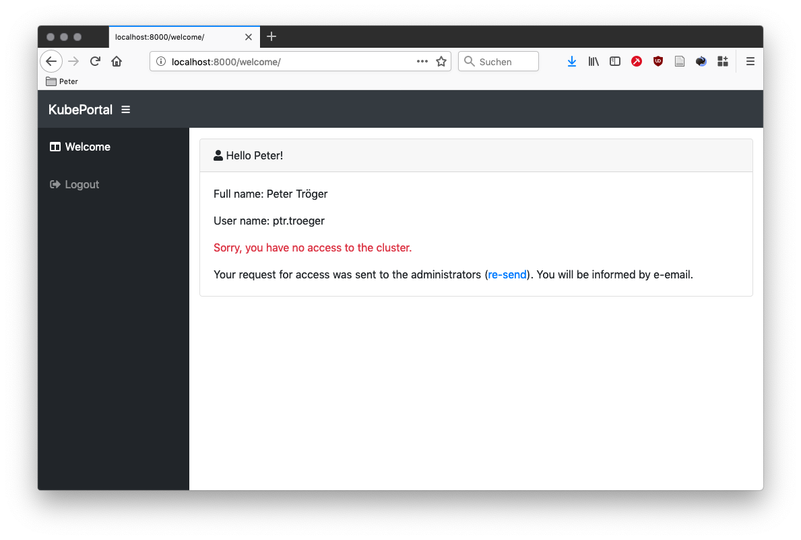
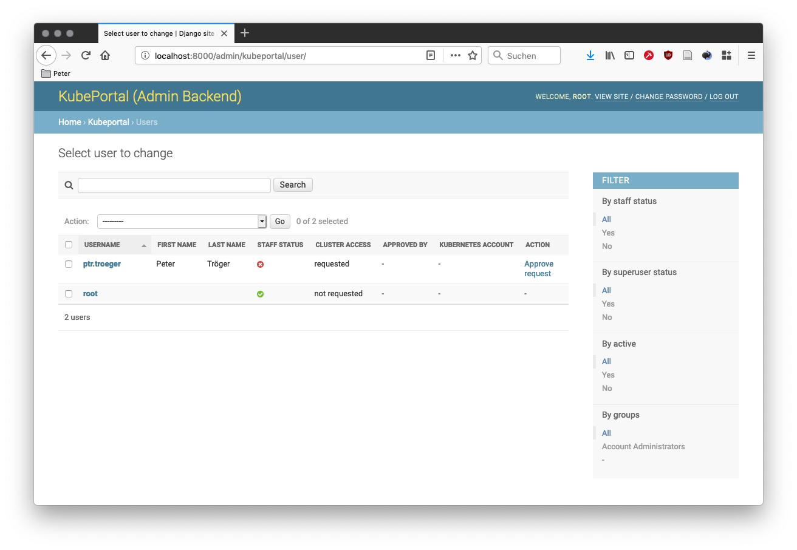
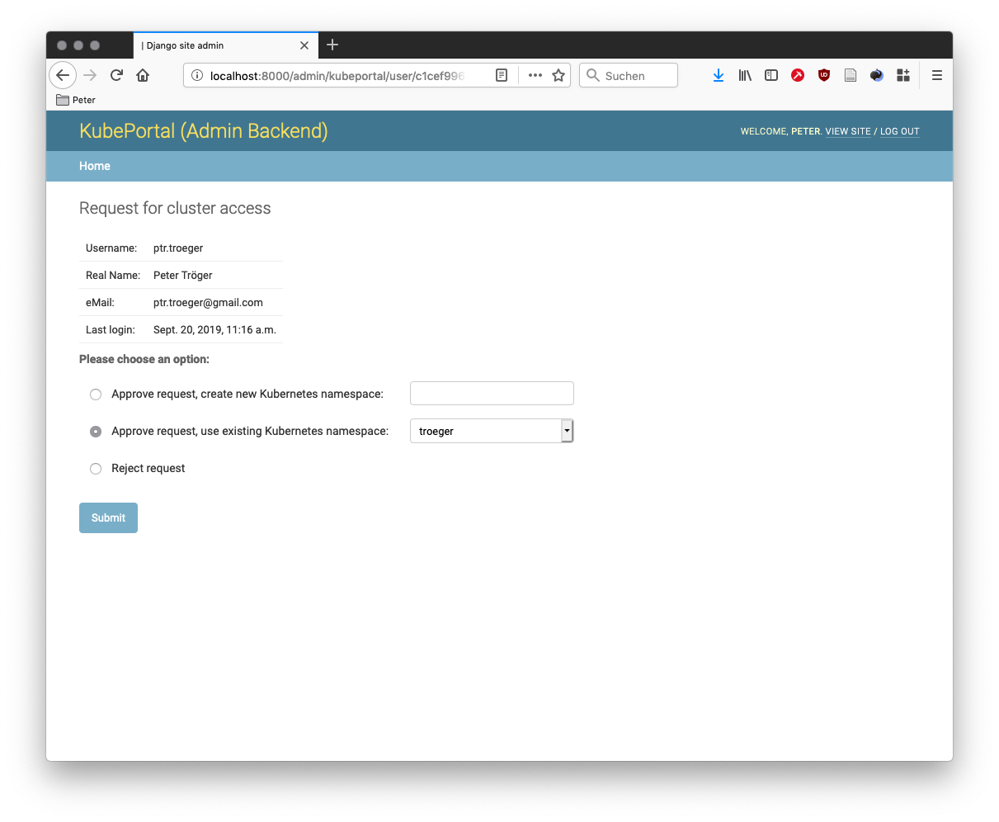

User management
###############

After deployment, first check if your configured frontend authentication method works as expected. The frontend user should see this welcome screen:

.. image:: static/kubeportal5.png

A click on the *request for cluster access* sends an email to all backend-enabled users:

You can also see in the users list in the backend that the cluster access status of the user changed to *requested*:

The admin(s) can now decide upon this request:

The link to this decision page is also sent by email to all portal users with backend access.

You have the choice between creating a new Kubernetes namespace for this user, using an existing one, or rejecting the request.
After acknowledging the request, the frontend changes immediately for the portal user. She can now access the *kubectl* config file
for the *default* service account in the chosen namespace.

Configuring admin users
-----------------------

Users known to the system, meaning that they logged-in at least once, can be promoted for being an admin user.
They have access to the backend pages, and get an email notification when users request cluster access.

A user can be granted admin rights by activating the *Staff status* checkbox in the user details.

The user 'root' automatically has this role.